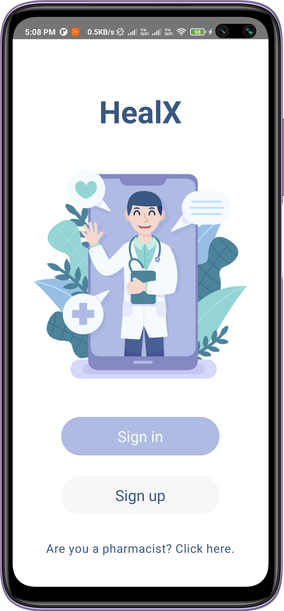
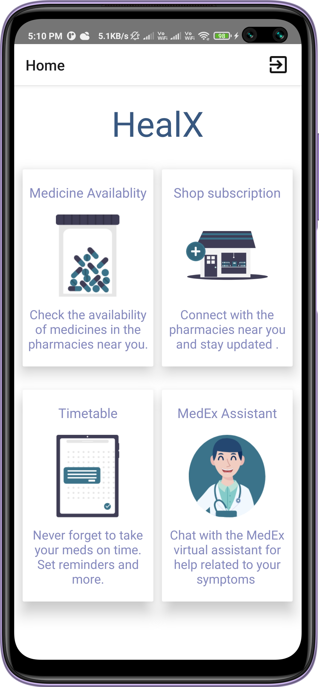
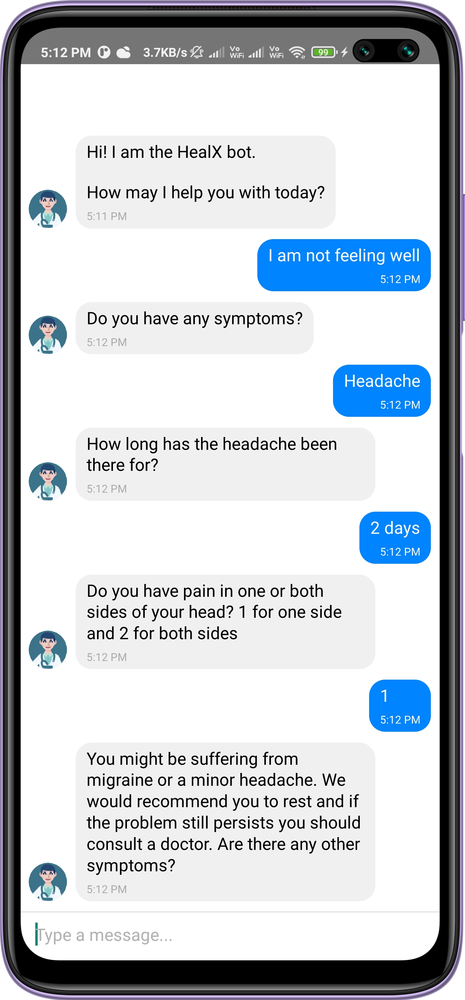
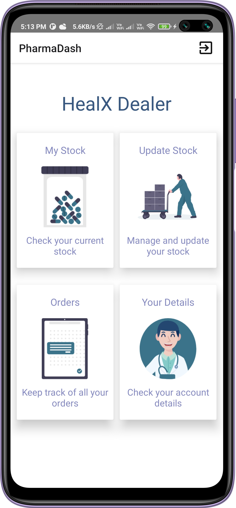

# HealX 

* This app helps local pharmacy store owners to connect to nearby users which will help them increase their sales.

* Users can search and buy medicines from the nearest available medical stores.Users can create a reminder to take their medicines on time and they can also interact with the chatbot.

* Shop owners can manage their inventory and orders from the app.

# Screenshots

